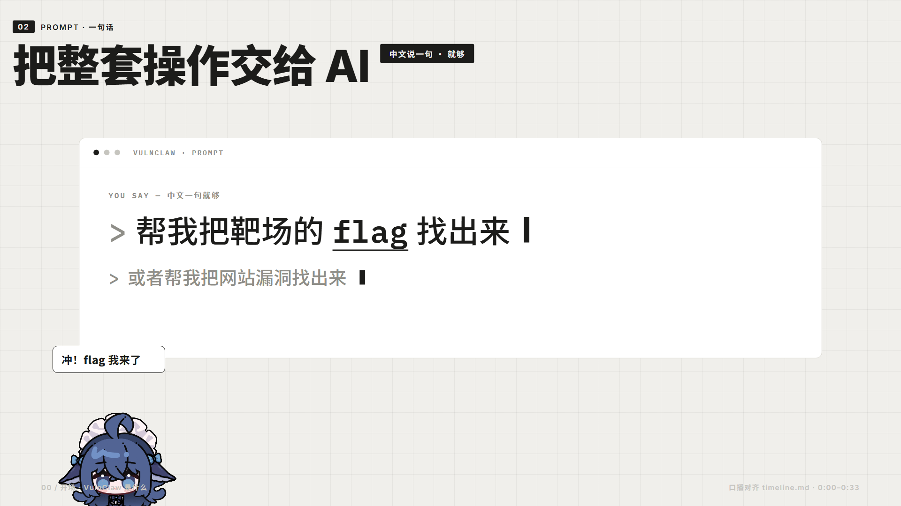
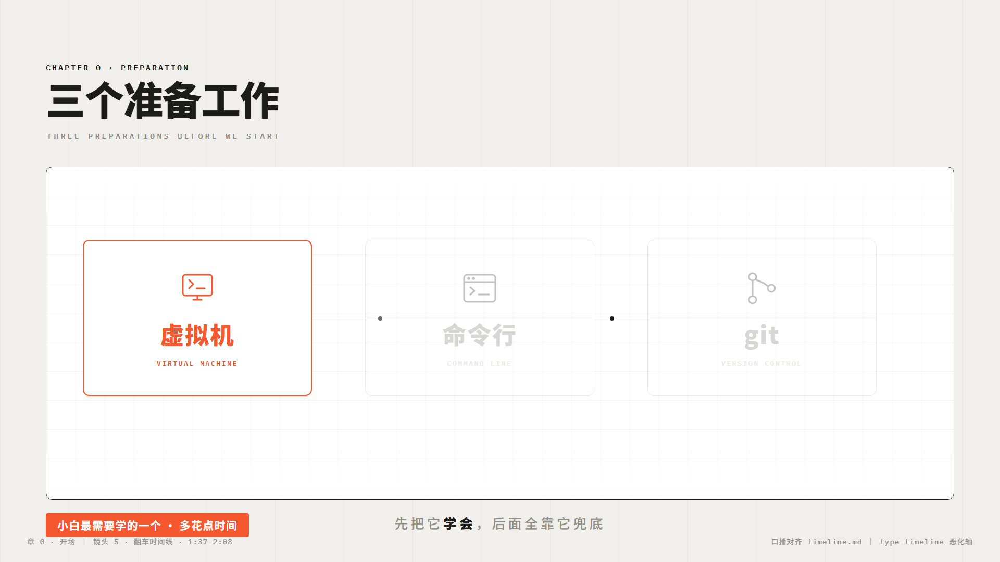
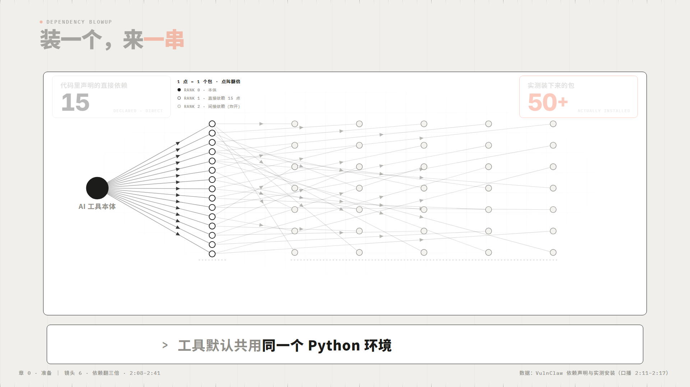
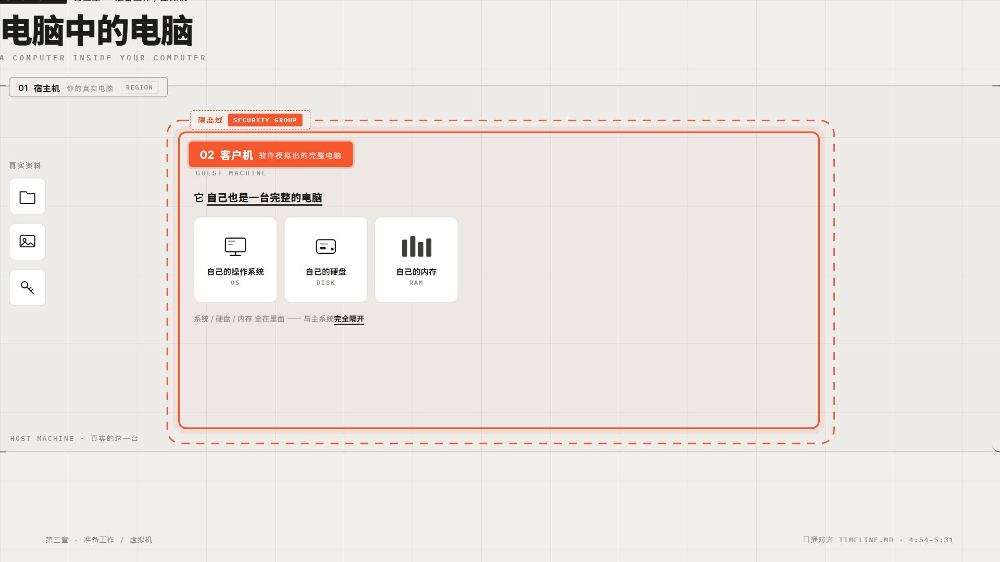
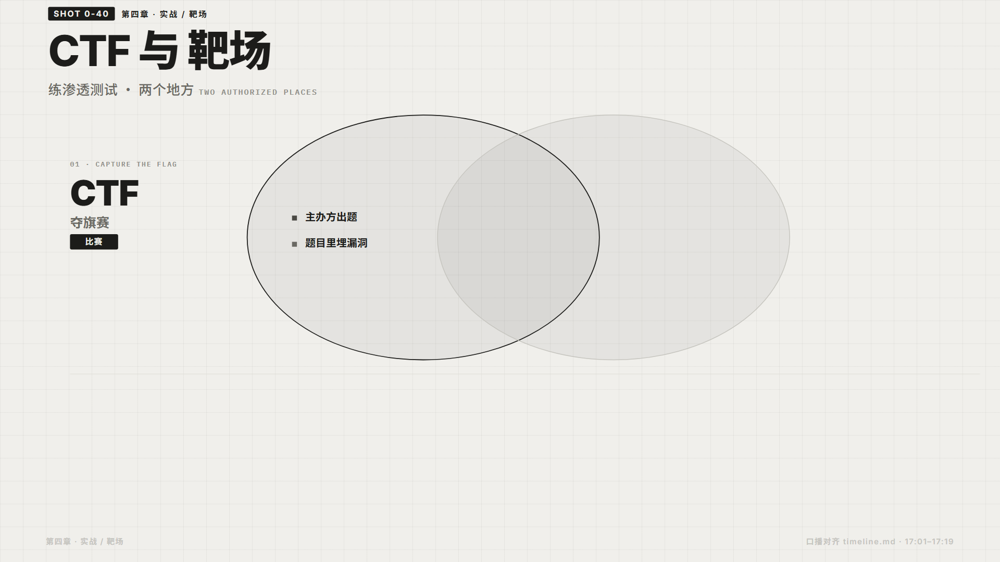
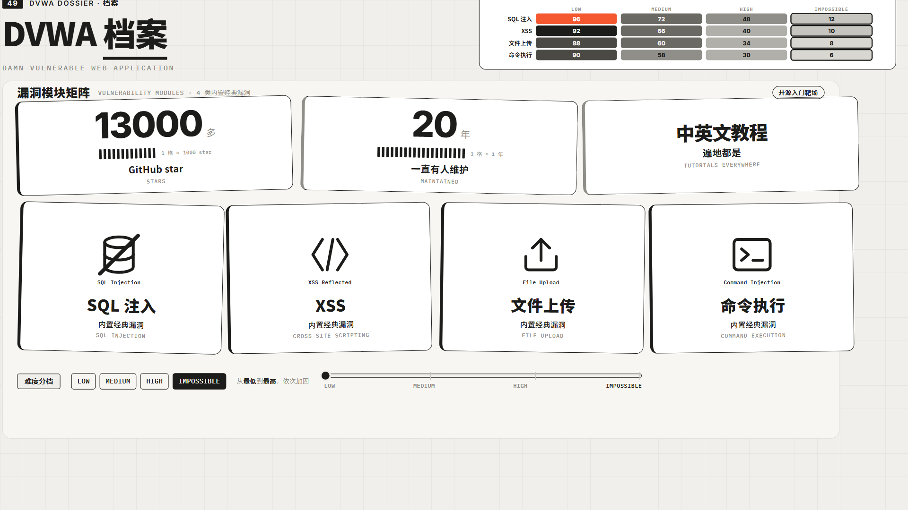

# swiss-shot-demos

> 瑞士国际主义风格 × 图表驱动的视频分镜演示动画 Skill —— 纸底墨字发丝线，每页一张匹配内容的图表

## 简介

把视频分镜做成**编辑部级排版 + 可视化图表**的演示动画：纸灰底 `#F0EFEB`、炭黑墨 `#1C1C1A`、发丝线、灰阶明度阶梯、**每页唯一强调橙 `#F5572F`**；每个镜头的主体是一张与内容匹配的图表（时间线、循环环、流程链、双列对照、点阵计数、热力矩阵、泳道、嵌套剖视……20 种词汇选型），而不是文字堆砌。一镜一 HTML，电影化底盘（黑场起手/虚拟时钟/镜头推拉/WebAudio 音效），全屏录屏即成片。

本 Skill 是"暗色油光"审美疲劳的系统性解药——全面禁用 glow/霓虹/渐变光斑，回归瑞士国际主义的平面克制。与 `video-shot-demos`（风格轮换体系）同底盘，但全系列统一一套瑞士设计语言，靠图表类型与版式变化制造镜头差异。

## 核心机制

| 机制 | 说明 |
|------|------|
| **瑞士设计系统** | 唯一正本 tokens：纸灰/墨/灰阶阶梯 L1-L7（明度即数据）/发丝线/唯一强调橙（每页只标一个主角）；Inter + Noto Sans SC + IBM Plex Mono 三件套；88px 页边距 12 列网格；组件库 12 件预装 |
| **图表词汇表** | 20 种"内容→图表"映射：数量→大字计数+点阵、序列→时间线、循环→环形回路、链路→流程链、对比→双列/slopegraph、结构→嵌套框/分层、分布→热力矩阵、代码→墨底终端卡…主体图形区 ≥55% 面积 |
| **禁用清单** | glow/霓虹 text-shadow、径向光斑、光泽渐变、vignette、扫描线、颗粒、大模糊阴影、弹跳闪烁——一票否决 |
| **动画性格** | quarticOut/cubicOut 快进快停；入场三式 pop/fade/draw（SVG 描线）；节拍动画一律 cue+tws 可冻结 |
| **QA 冻结钩子** | URL 加 `#auto,t=毫秒` 自动起播并冻结该时刻，无头截图零改文件；审美四问逐页过 |
| **电影化播放器** | 虚拟时钟黑场起手 / camTo·camFocus·**camCut 硬切** / WebAudio 六原语音效 / HUD 墨色进度条 |
| **生产纪律** | cue 时刻=口播句绝对时间差（注释带原句+时间戳）；数字白名单不编造；不伪造终端回显 |

## 使用方式

```
用 swiss-shot-demos 把这期视频的口播稿做成演示动画：瑞士风格、图表驱动，每镜头一个 HTML，先出图表选型分镜表我确认
```

```
把这批演示页全部改成瑞士国际主义风格：去暗色油光，文字段落换成匹配的可视化图表，cue 对齐口播不动
```

## 内置素材与实例

- **68 个成片镜头 + 调度板总览**（`assets/examples/vulnclaw-tutorial/`，「全网最基础 AI 渗透教程」全片，双击 index.html 即可运行）——A 类信息动效页（图表最大化）与 B 类拟真仿真页（仿真本体保留+外围瑞士化）混编
- **起步骨架** `assets/template.html` —— 底盘（含 QA 钩子）+ 瑞士 tokens + 组件库 + 示例图表 预装一体，复制后只改【改这里】区
- 6 张大肥鱼 GIF（纸底气泡吐槽：白底+1px 墨边+黑字+橙关键词）

## 图表词汇预览（完整选型表见 references/chart-vocabulary.md）

| 图表词汇 | 样板页 |
|------|--------|
| 大字计数 + AI 循环环 | shot-0-1（五幕范本） |
| 恶化时间线 | shot-0-5 翻车四步 |
| 点阵翻倍对撞 | shot-0-6 依赖 15→50+ |
| 嵌套剖视 | shot-0-12 宿主机套客户机 |
| 状态机弧线 | shot-0-29 git 痛点 |
| 双列对照 | shot-0-40 CTF vs 靶场 |
| 热力矩阵 | shot-0-49 DVWA 漏洞矩阵 |

<table>
<tr>
<td align="center" width="16.6%"><a href="assets/examples/vulnclaw-tutorial/shot-0-1_VulnClaw是什么.html"></a></td>
<td align="center" width="16.6%"><a href="assets/examples/vulnclaw-tutorial/shot-0-5_翻车时间线.html"></a></td>
<td align="center" width="16.6%"><a href="assets/examples/vulnclaw-tutorial/shot-0-6_依赖翻三倍.html"></a></td>
<td align="center" width="16.6%"><a href="assets/examples/vulnclaw-tutorial/shot-0-12_电脑中的电脑.html"></a></td>
<td align="center" width="16.6%"><a href="assets/examples/vulnclaw-tutorial/shot-0-40_CTF与靶场.html"></a></td>
<td align="center" width="16.6%"><a href="assets/examples/vulnclaw-tutorial/shot-0-49_DVWA档案.html"></a></td>
</tr>
</table>

<sub>↑ 预览图由 QA 冻结钩子在对应时间点截帧生成，点击打开成片页面。</sub>

## 核心特性

- **图表优先** — 拿到口播先问"这是什么图"，主体图形区 ≥55%，文字只做标题/标签/结论
- **明度即数据** — 灰阶阶梯承载全部层级，彩色只留一个橙标"本页唯一主角"
- **排版即力量** — Inter 大字（断言数字 120-260px）+ 12 列网格 + 非对称布局
- **克制是美德** — 禁用清单一票否决暗色油光全家桶
- **QA 内置** — `#auto,t=` 冻结钩子 + 审美四问（系统一致/无发光/层级网格/图表落位）

## 技术栈

- 原生 HTML/CSS/SVG（图表全部手写，零外部图表库）
- WebAudio API（音效合成）
- Google Fonts 三件套（Inter / Noto Sans SC / IBM Plex Mono）

## Prompt 参考

详见 `references/`（swiss-system 设计正本 / chart-vocabulary 图表词汇 / production-spec 生产纪律）
