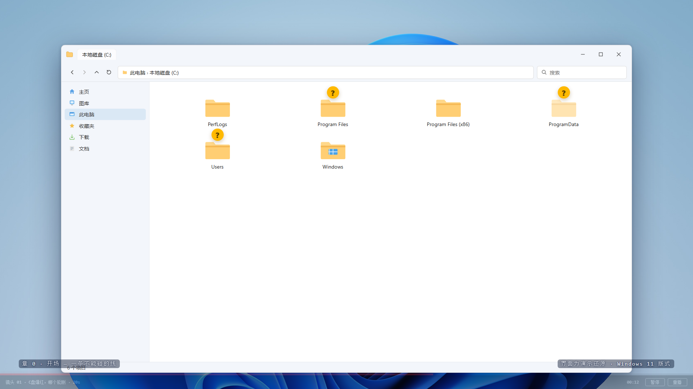
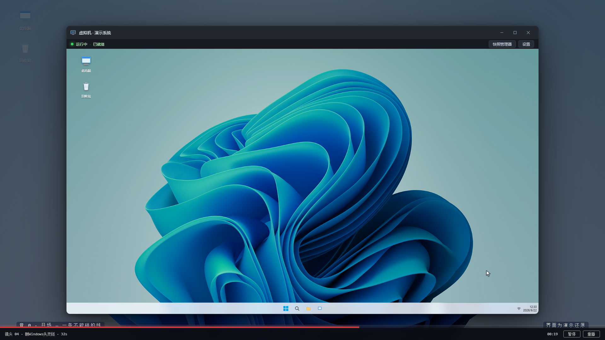
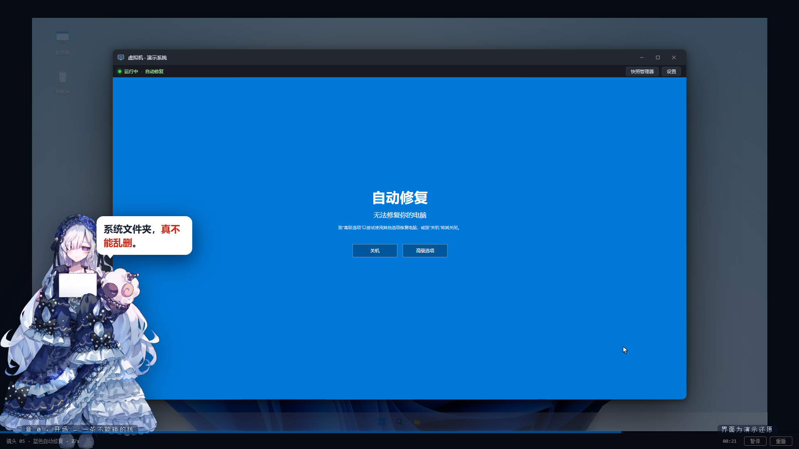
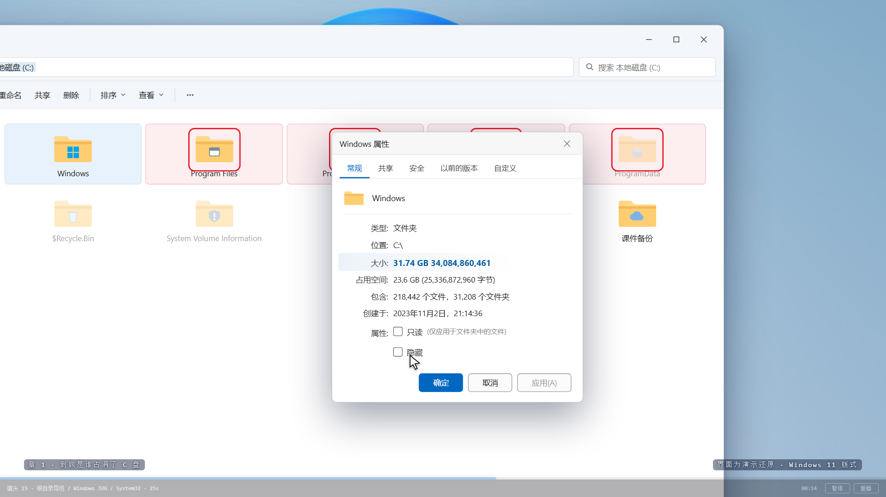
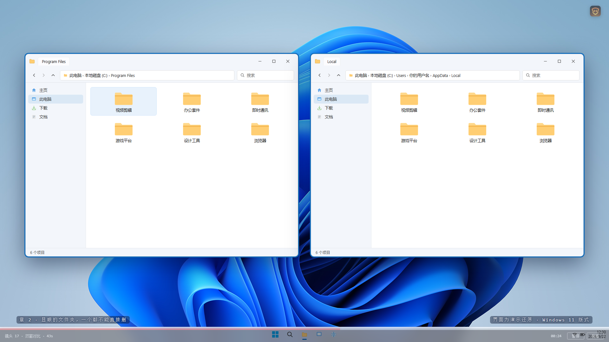
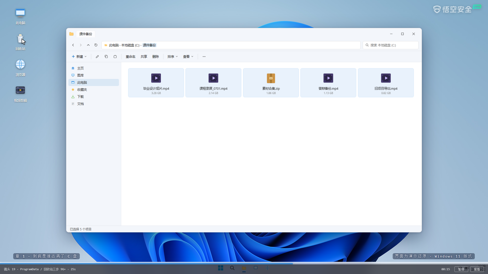

# win11-ui-demos

> 仿 Windows 11 系统仿真演示动画 Skill —— 1:1 还原真电脑 + 光标演出

## 简介

制作"仿 Win11 系统 UI"的写实仿真网页演示动画：观众像在看一台真 Win11 电脑的精心编排录屏——Bloom 壁纸桌面、亚克力任务栏、资源管理器逐层打开、系统弹窗报错、蓝屏自动修复，一支**会自己操作的鼠标**引导观众看完全程，教学标记（问号徽章/警告牌/容量爆红）在还原界面上叠加讲解。每镜头一个独立 HTML，电影化播放器底盘，全屏录屏即成片。

内容完全开放：任何电脑操作教学、系统知识、软件教程、安全科普都能转译成"真电脑里发生的事"。

## 核心机制

| 机制 | 说明 |
|------|------|
| **Win11 仿真套件** | 17 类组件 1:1 还原：桌面图标/任务栏/资源管理器（标题栏·地址栏·导航窗格·状态栏）/开始菜单/右键菜单/通知 Toast/系统对话框/WinRE 蓝屏——Light Fluent 实测色值（窗底 #f3f6fb、accent #0067c0、亚克力任务栏 blur(18px)） |
| **光标演出** | 全程可见的鼠标是叙事者：`curTo()` 弧线飞行 + `clickFx()` 点击缩放 + 双击节奏，观众跟着光标走 |
| **视图切换三同步** | 进入下一级目录同时更新标签页/地址栏面包屑/状态栏项目数，缺一处即穿帮 |
| **教学标记层** | 问号徽章（"哪个能删?"悬念逐一 pop）、poof 删除动画、容量条爆红呼吸、警告徽章——"老师的手"叠在真界面上，与还原层分离 |
| **真实系统文案** | 错误码 0xc0000142、"存储空间不足"通知原文、面包屑 ›、"N 个项目"——细节可信度来源 |
| **因果链叙事** | 乱删 → 报错 → 蓝屏修复：系统界面的天然剧情弧 |
| **电影化播放器** | 虚拟时钟黑场起手 / 镜头推拉 camTo·camFocus / WebAudio 音效 / HUD 底部唤出 / 可暂停重播 |

## 使用方式

```
用 win11-ui-demos 把这段 Windows 操作教程做成系统仿真演示动画，每个镜头一个 HTML，先出分镜表我确认
```

```
这是我视频的口播稿（讲 C 盘清理），把里面的电脑操作部分做成仿 Win11 的光标演示动画，输出到 demo/
```

```
把这批系统界面演示页翻新：还原度不够的地方修一下，光标轨迹要跟口播讲解对齐
```

## 内置素材与实例

- **21 个成片镜头 + Win11 专用总览**（`assets/examples/wukong-c-clean/`，悟空安全 C 盘清理商单的仿真子集，双击 index.html 即可运行）
- **素材**：Win11 Bloom 壁纸 + XP 彩蛋壁纸（`material/`）、14 张大肥鱼 GIF 表情包（按文件名情绪词直选）、5 张安安立绘、悟空品牌图标
- **起步骨架** `assets/template.html` —— 底盘 + 仿真套件 CSS 全内置（纯 CSS Bloom 渐变兜底，可换真实壁纸），复制后只改【改这里】区

## 手法预览（实例对照，完整见 references/simulation-patterns.md）

| 手法 | 样板页 |
|------|--------|
| 此电脑爆红 + 报错因果链 + 光标双击 | shot-01 |
| 开始菜单 + 删除 Windows 警告链 | shot-04 |
| WinRE 蓝屏 + 自动修复百分比 | shot-05 |
| 桌面右键菜单 + 回收站三步 | shot-19 |
| 双资源管理器并排对比 | shot-17 |
| 根目录导览 + 问号徽章逐一揭晓 | shot-15 / shot-21 |
| 经典选项卡对话框（文件夹选项） | shot-41 |

<table>
<tr>
<td align="center" width="16.6%"><a href="assets/examples/wukong-c-clean/shot-01_C盘爆红哪个能删.html"></a></td>
<td align="center" width="16.6%"><a href="assets/examples/wukong-c-clean/shot-04_删Windows失灵链.html"></a></td>
<td align="center" width="16.6%"><a href="assets/examples/wukong-c-clean/shot-05_蓝色自动修复.html"></a></td>
<td align="center" width="16.6%"><a href="assets/examples/wukong-c-clean/shot-15_根目录导览.html"></a></td>
<td align="center" width="16.6%"><a href="assets/examples/wukong-c-clean/shot-17_双窗对比.html"></a></td>
<td align="center" width="16.6%"><a href="assets/examples/wukong-c-clean/shot-19_回收站三步.html"></a></td>
</tr>
</table>

<sub>↑ 预览图由质检工具在对应时间点截帧生成，点击打开成片页面。</sub>

## 核心特性

- **像素级还原** — Light Fluent 精确色值/圆角/双层阴影/亚克力，系统字体栈零 webfont
- **光标是主角** — 移动→悬停→单击→双击全程演出，没有光标的系统演示=截图集
- **还原层与教学层分离** — 界面归界面 1:1，讲解归讲解（标记轻盈不遮界面）
- **真实系统文案库** — 错误码/通知原文/面包屑，细节真实感
- **角色 GIF 吐槽** — 大肥鱼按情绪锚点登场（震惊呆滞/腹黑威胁/摆烂）
- **"界面为演示还原"角注** — 每页必带的声明，规避商标问题

## 技术栈

- 原生 HTML/CSS/JS（零构建、零 webfont、单文件双击即开即用）
- WebAudio API（音效合成）
- 内联 SVG（全部系统图标手绘矢量）

## Prompt 参考

详见 `references/`（win11-kit 组件规格速查 / simulation-patterns 仿真叙事手法）
